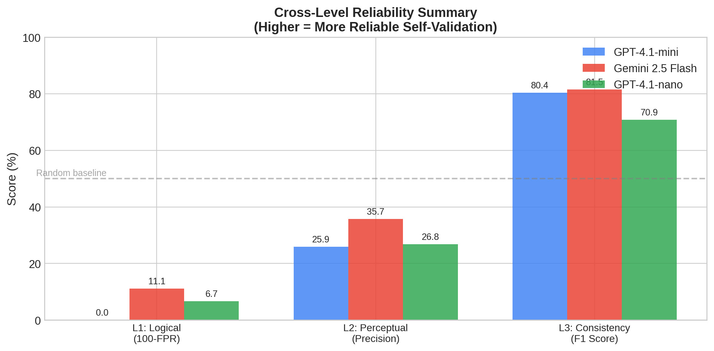

# E²-Bench: Eval of Eval for Measuring Self-Validation Reliability in LLM Agents



As Large Language Models (LLMs) are increasingly deployed as autonomous agents, their ability to self-validate outputs has become a critical bottleneck. While existing benchmarks evaluate whether an agent can *complete* a task, they rarely measure whether the agent *knows* if it has completed the task correctly.

**E²-Bench (Eval of Eval)** is a comprehensive benchmark that measures self-validation reliability across three cognitive levels, mirroring the cognitive hierarchy of human quality assurance.

## The Three-Level Validation Framework

E²-Bench evaluates agents across 653 tasks in three distinct levels:

### Level 1: Logical Validation (500 tasks)
Can the agent verify objective correctness where a definitive ground truth exists?
- **Code Generation** (200 tasks): Hidden test suites
- **Logical Reasoning** (150 tasks): Deterministic answers (e.g., Game of 24)
- **Data Analysis** (150 tasks): Pre-computed numerical results

### Level 2: Perceptual Validation (53 tasks)
Can the agent detect "common sense" quality issues that a human would notice in seconds?
- **UI/UX Defect Detection**: We programmatically generate valid HTML/CSS web pages and inject common UI/UX defects (image distortion, low contrast, layout overflow, etc.).
- *Note: Visual renderings (screenshots) of all planted bugs are available in `eval_set/perceptual_validation/screenshots/`.*

### Level 3: Consistency Validation (100 tasks)
Can the agent ensure that different parts of a complex artifact do not contradict each other?
- **Cross-Context Contradictions**: We generate multi-part documents (financial reports, technical docs) and inject subtle but critical contradictions between components.

## Key Findings

We evaluated three frontier models: **GPT-4.1-mini**, **Gemini 2.5 Flash**, and **GPT-4.1-nano**.

1. **The "Yes Man" Bias (Level 1)**: Models are maximally unreliable as self-judges. The False Positive Rate (incorrectly approving wrong solutions) ranges from 66% to 100%. When an agent says "my code is correct," this claim carries almost no information.
2. **The Over-Reporting Problem (Level 2)**: Models exhibit the opposite failure mode here—they are *too critical*. While they achieve 100% recall in finding planted UI bugs, they hallucinate many non-existent ones, yielding only 26-36% precision.
3. **Native Modality Advantage (Level 3)**: Models are most reliable at consistency checking (82-93% recall), likely because cross-referencing text operates entirely within their strongest modality.

## Repository Structure

```
e2_bench/
├── eval_set/                  # The complete dataset (653 tasks)
│   ├── code_generation/       # Level 1: Code tasks
│   ├── data_analysis/         # Level 1: Data tasks
│   ├── reasoning/             # Level 1: Logic tasks
│   ├── perceptual_validation/ # Level 2: UI/UX tasks (includes HTML and screenshots)
│   └── consistency_validation/# Level 3: Contradiction tasks
├── harness/                   # Evaluation framework
│   └── e2_bench.py            # Core evaluation logic for all 3 levels
├── scripts/                   # Task generation and analysis scripts
├── results/                   # Raw evaluation results for all models
└── paper/                     # LaTeX source and compiled PDF of the paper
    └── figures/               # All generated charts and heatmaps
```

## Running the Evaluation

The evaluation harness supports any OpenAI-compatible API model.

```bash
# Install dependencies
pip install openai

# Set your API key
export OPENAI_API_KEY="your-api-key"

# Run the evaluation (see scripts/run_pilot_v3_extra_models.py for an example)
python scripts/run_pilot_v3_extra_models.py
```

## Future Work

- **Expand Model Coverage**: Evaluate Claude 3.5 Sonnet, GPT-4o, Llama 3, and other frontier models.
- **Multimodal Perceptual Validation**: Currently, Level 2 uses HTML source code as input. Future work will incorporate the rendered screenshots for true multimodal evaluation.
- **Cross-Evaluation**: Have Model A evaluate Model B's outputs to quantify "Self-Bias" vs. general evaluation capability.

## Citation

If you use E²-Bench in your research, please cite our paper:

```bibtex
@misc{dong2026e2bench,
  title={E$^2$-Bench: Eval of Eval for Measuring Self-Validation Reliability in LLM Agents},
  author={Qinglin Dong},
  year={2026},
  url={https://github.com/QinglinDong/e2-bench}
}
```
